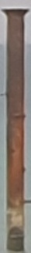
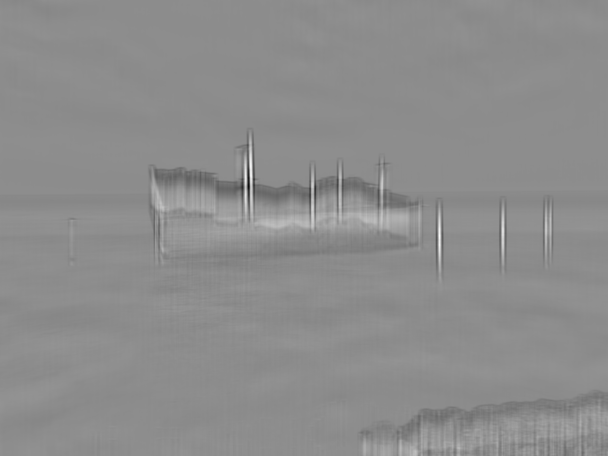

# Template Matching

Template matching is a technique in digital image processing for finding small parts of an image which match a template image. It can be used in manufacturing as a part of quality control, a way to navigate a mobile robot, or as a way to detect edges in images.

In this program we want to detect metal bars in the image below.

First, we define a patch to work with. We just crop one of the current bars as a patch.

    

To make our search easier we crop it even more.

    

Now we perform cross-correlation on the given image with provided patch. Here is the result:

If we pay attention to the result we can see that places that was placed a bar are generally brighter but if filter that by bright pixels there are some unwanted places that passes the filter. So to solve that we have to look for clusters of bright pixels. One simple way to do that is to template match using a white rectangle patch. This will look for cluster of white pixels.
 
Here is the performed cross-correlation:

    
    

Now we can see that the bars are much better separated.
We filter pixels that have high intensity and get their coordinates. Then we find clusters that are closed together and look for the highest intesity in the first cross-correlation becuase that is the best possible matching. If we filter these out and draw a rectangle around them, the result will be like this:

As we can see the bars have been detected perfectly.
